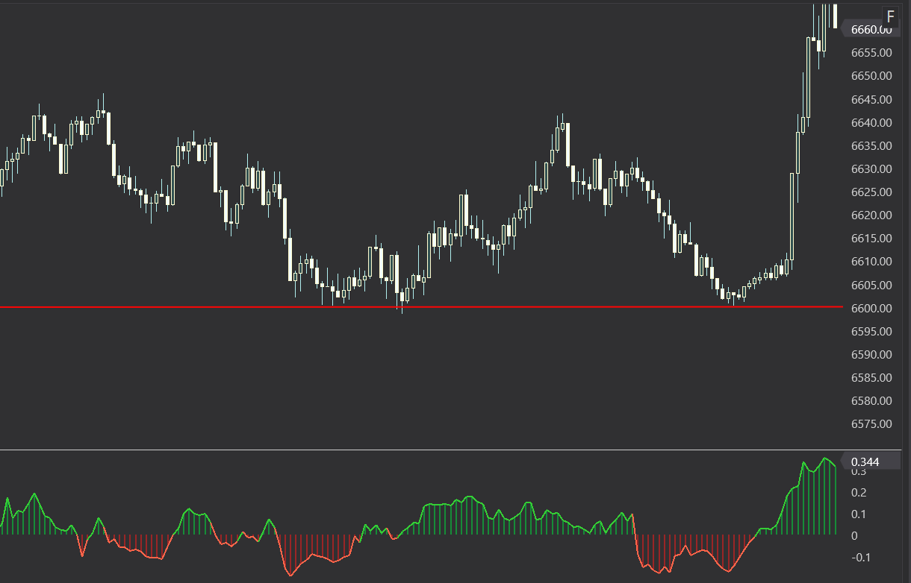
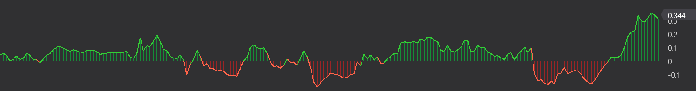
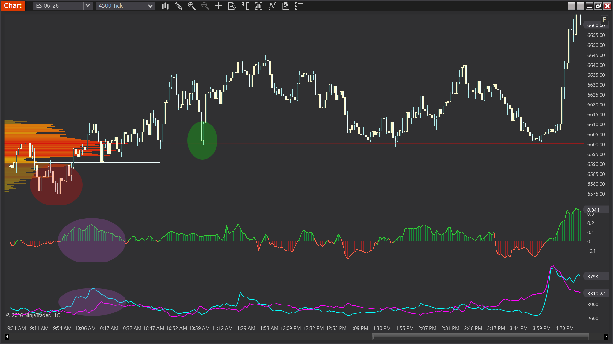

# Hidden Liquidity Bias

> Context-aware hidden-liquidity oscillator for NinjaTrader 8. Detects block trades and icebergs, then
> scores them by *where* they happened and *what price did next* - not just that they happened.

NinjaTrader 8 indicator in C# / NinjaScript. Single file, no dependencies, MIT licensed.

ES 4500-tick. The bias score runs in the lower panel - green where accumulated hidden-liquidity
evidence is bullish, red where it is bearish.

Full workspace view, for context:

The volume profile on the left and the lower panel are separate tools and are **not** part of this
repository - only the green/red bias oscillator is. The shaded ellipses are annotations from the
original teaching chart this frame was taken from.

> [!IMPORTANT]
> **This indicator plots forward only. It cannot draw on historical bars.**
>
> The bias score is built from live market data events in `OnMarketData` - individual prints, their
> size, and their timing. NinjaTrader does not retain that stream for bars that were already on the
> chart when the indicator loaded, so there is nothing to reconstruct from. Bars before the moment you
> add it will stay blank, and that is correct behaviour rather than a fault.
>
> Two ways to use it:
> - **Live** - add it to a chart and it accumulates from that point forward.
> - **Market Replay / Bar Replay** - replay feeds the same tick events, so the indicator populates
>   exactly as it would live. This is the way to study it on past sessions.
>
> It follows that this indicator cannot be backtested against historical bars in the Strategy
> Analyzer. Replay is the only route to historical behaviour.

## What it does

Large resting orders leave two fingerprints in the tape: **blocks** (a single oversized print) and
**icebergs** (the same price refilling over and over in small clips, which is one large order wearing a
disguise). Detecting either is well-trodden ground. This indicator is about what you do with the
detection afterwards.

An iceberg absorbed at the top of a balanced range means something different from the same iceberg
absorbed at the low. So each detected event is scored on two axes:

- **Location** - where in the current developing range the event occurred.
- **Response** - what price actually did in the window after it. Absorption that holds scores
  differently from absorption that gets run over.

Those combine into a single signed bias score, plotted as a histogram: positive for accumulated
bullish hidden-liquidity evidence, negative for bearish. Threshold bands mark where the score has
gotten interesting, and detected events are dotted onto the plot so the score can be traced back to
the prints that produced it.

Range detection is ATR-based with explicit breakout confirmation, so "the current range" is a measured
thing rather than a fixed lookback, and a range that breaks is retired rather than silently distorting
the location term.

## Implementation notes

**Iceberg detection is a time-windowed aggregation, not a size test.** A block is trivially a print
over a threshold. An iceberg is N separate clips, each *under* a max size, at the same price, inside a
rolling millisecond window, summing past a total. That is four parameters that have to agree, and the
window is the one that matters - widen it and ordinary two-way trade at a level starts looking like an
iceberg. Candidates live in a fixed-size pool and expire out of it; nothing allocates per tick.

**Fixed-size ring buffers throughout.** `OnMarketData` fires on every tick of every instrument on the
chart. Liquidity events go into a preallocated ring (`liqBuf`, `liqHead`, `liqCount`) and iceberg
candidates into a fixed pool. A `List<T>` that grows across a session is the standard way a tick-driven
NinjaScript indicator becomes the reason a chart stutters after two hours.

**Scoring is decayed by a lookback window, not reset on bars.** Hidden liquidity does not stop
mattering because a bar closed. Events age out on a minutes-based window, which means the score
behaves the same way on a 500-tick chart as on a 5-minute one.

**Custom SharpDX `OnRender` with cached device brushes.** Histogram bars, event dots, threshold bands
and range highlights are drawn directly. Direct2D brushes are expensive to create and are cached
against their parameters (`dxCachedHlOpacity`, `dxCachedHlR/G/B`), rebuilt only when the user actually
changes a colour - not per frame, which is what a naive implementation does.

**Two-axis scoring instead of a signal.** The alternative design is a boolean "iceberg here" marker.
That is easier and much less useful, because it discards the two things that determine whether the
event mattered. Keeping location and response as separately weighted terms (`LocationBiasStrength`,
`ResponseWeight`) means the output stays interpretable and the contribution of each can be isolated.

## Parameters

| Setting | Purpose |
|---|---|
| `Block Threshold (contracts)` | Single-print size that qualifies as a block. |
| `Iceberg Time Window (ms)` | Rolling window clips must fall inside to be treated as one order. |
| `Iceberg Max Clip Size` | Upper bound per clip - above this it is a block, not an iceberg. |
| `Iceberg Min Clips` | How many refills before a candidate is confirmed. |
| `Iceberg Min Total (contracts)` | Aggregate size the clips must reach. |
| `Lookback (minutes)` | How long an event keeps contributing to the score. |
| `Response Weight` | Weight of the price-response term. |
| `Location Bias Strength` | Weight of the location-in-range term. |
| `ATR Period / Multiplier / Lookback` | Range detection sizing. |
| `Range Lookback Bars / Max Range Ticks` | Bounds on what counts as a range. |
| `Breakout Confirm Ticks / Bars` | Confirmation before a range is retired. |
| `Warn / High Threshold` | Band levels, and the alert trigger points. |
| `Highlight` group | Range shading - opacity and RGB, on price chart and/or oscillator. |
| `Visual` group | Histogram bars, bias line, event dots, threshold bands. |

## Install

1. Download `src/HiddenLiquidityBias.cs`.
2. In NinjaTrader 8: **New > NinjaScript Editor**, right-click **Indicators > New Indicator**, then
   paste the file contents over the generated stub. Or drop the `.cs` file directly into
   `Documents\NinjaTrader 8\bin\Custom\Indicators\`.
3. **Compile** (F5). NinjaTrader regenerates its own wrapper code on compile - the generated region is
   deliberately not included in this repo.
4. Add the indicator to a chart from **Indicators**.

Requires NinjaTrader 8 and a data feed with tick-level market data. **No Order Flow + subscription
required.** Works on any bar type.

5. Let it run, or start **Market Replay**. The panel will be empty on the bars that preloaded - see
   the note at the top of this README. That is expected.

## Background

This was the original flagship indicator behind [Obsidian Flow](https://obsidianflow.tech). It has been
retired from the commercial suite and released free, in full, with the licensing code removed.

Block and iceberg detection is not a proprietary technique - anyone can arrive at the formula. What is
worth reading here is the engineering around it: the aggregation strategy, the allocation discipline
under tick load, and the render caching.

## Disclaimer

This indicator is a visualization and research tool. It is not trading advice, it does not generate
orders, and nothing here is a claim about profitability. Futures trading carries substantial risk of
loss. Test on simulated data before using anything on a live account.

## License

MIT - see [LICENSE](LICENSE). Built by Tarrell Allen.
